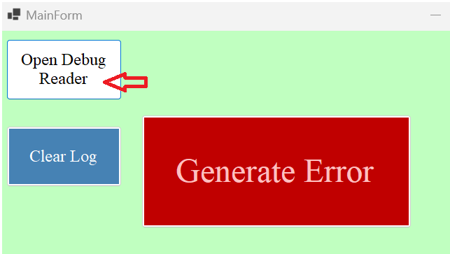
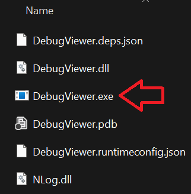
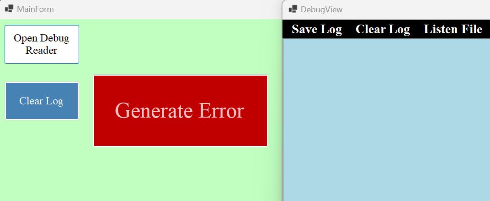
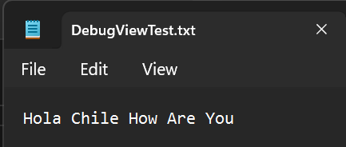
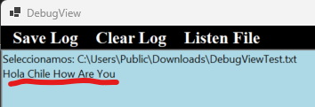

# Project Resume

In this project we can select a file to watch its changes and print in the form the new information added.

## Open Debuguer
1. 

2. 

3. 

## Watch Modifications

1. We going to add text to the select file and these changes will be copy in the form:

    * 

    * 